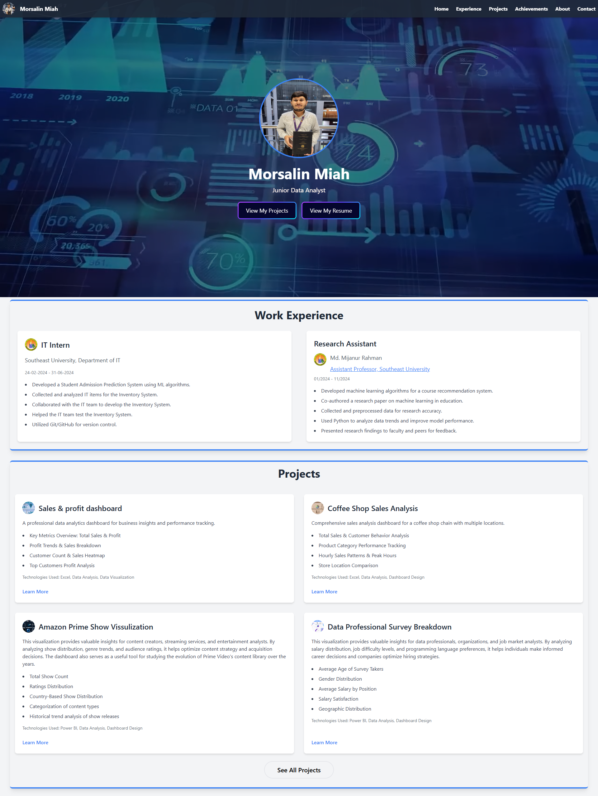

# 🌟 Morsalin Miah - Portfolio  

Welcome to my portfolio website! 🚀 I am a **Data Analyst** with a strong foundation in **data analysis, machine learning, and data visualization**. My passion lies in transforming raw data into meaningful insights to drive business and research decisions.  

## 🔗 Live Website  
🔗 [Visit My Portfolio](https://morsalinmiah.netlify.app/)  

## 🏠 Home Page Preview  
  

## 🛠️ About Me  
🎓 **Education:** Bachelor’s in Computer Science, **Southeast University**  
📊 **Skills:** Python, SQL, Power BI, Excel, Machine Learning  
📚 **Interests:** Data Science, AI, Research on Medical AI  
💼 **Experience:**  
- **Data Analyst Intern** - Southeast University  
- **Research Assistant** - Southeast University  

## 📂 Featured Projects  
Here are some of my key projects showcasing my expertise in data analytics and visualization:  

### 📌 [Amazon Prime Show Visualization](https://github.com/MorsalinMiah7/Amazon-Prime-Shows-Visualization)  
📊 Developed an interactive **Power BI dashboard** to analyze Amazon Prime show data.  
**Tech Stack:** Power BI, Excel, SQL  

### 📌 [Course Recommendation System](https://github.com/MorsalinMiah7)  
🎓 Built a **machine learning-based recommendation system** to help students choose courses based on preferences and academic history.  
**Tech Stack:** Python, Machine Learning, Pandas, NumPy  

### 📌 [Coffee Shop Sales Dashboard](https://github.com/MorsalinMiah7/Coffee-Shop-Sales-Dashboard)  
☕ Designed an **Excel-based dashboard** to analyze coffee shop sales trends and peak hours.  
**Tech Stack:** Excel, Pivot Tables, Data Visualization  

## 📞 Contact Me  
📧 **Email:** [info.morsalin.miah@gmail.com](mailto:info.morsalin.miah@gmail.com)  
🔗 **LinkedIn:** [Morsalin Miah](https://www.linkedin.com/in/morsalin-miah)  
🐙 **GitHub:** [MorsalinMiah7](https://github.com/MorsalinMiah7)  
📞 **WhatsAPP** +880 1866368189

---

⭐ Feel free to check out my projects and reach out for collaborations or opportunities! 🚀  
